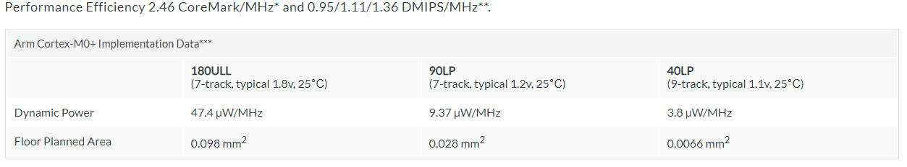
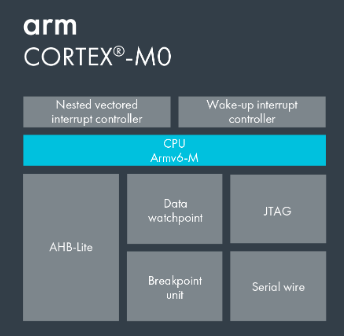

# [arm cortex M0](https://github.com/SoCXin/CM0)

  

## [描述](https://github.com/SoCXin/CM0/wiki) 

Cortex M0是ARM最精简的低功耗低端处理器内核IP，其核心架构为ARMv6M，其运算能力0.9DMIPS/MHz，但与其对应PK的16位与8位处理器相比已经足够强大，由于Cortex M0的运算性能大幅提高，所以在同样任务的执行上Cortex M0只需较低的运行速度，降低了整体的动态功耗。

Cortex M0最大特点是低功耗的设计，Cortex-M0为32位、3级流水线RISC处理器，其核心仍为冯.诺依曼结构，是指令和数据共享同一总线的架构。

 
 

### [收录资源](https://github.com/SoCXin/8051)

* [nuvoton](https://github.com/SoCXin/nuvoton)
    * [N76E003](https://github.com/SoCXin/N76E003)

* [Nordic](https://github.com/SoCXin/Nordic)
    * [nRF24LE1](https://github.com/SoCXin/nRF24LE1)

#### 相关工具

[arm-none-eabi](https://github.com/SoCXin/arm-none-eabi) 

###  [SoC芯平台](http://SoC.Xin) 
